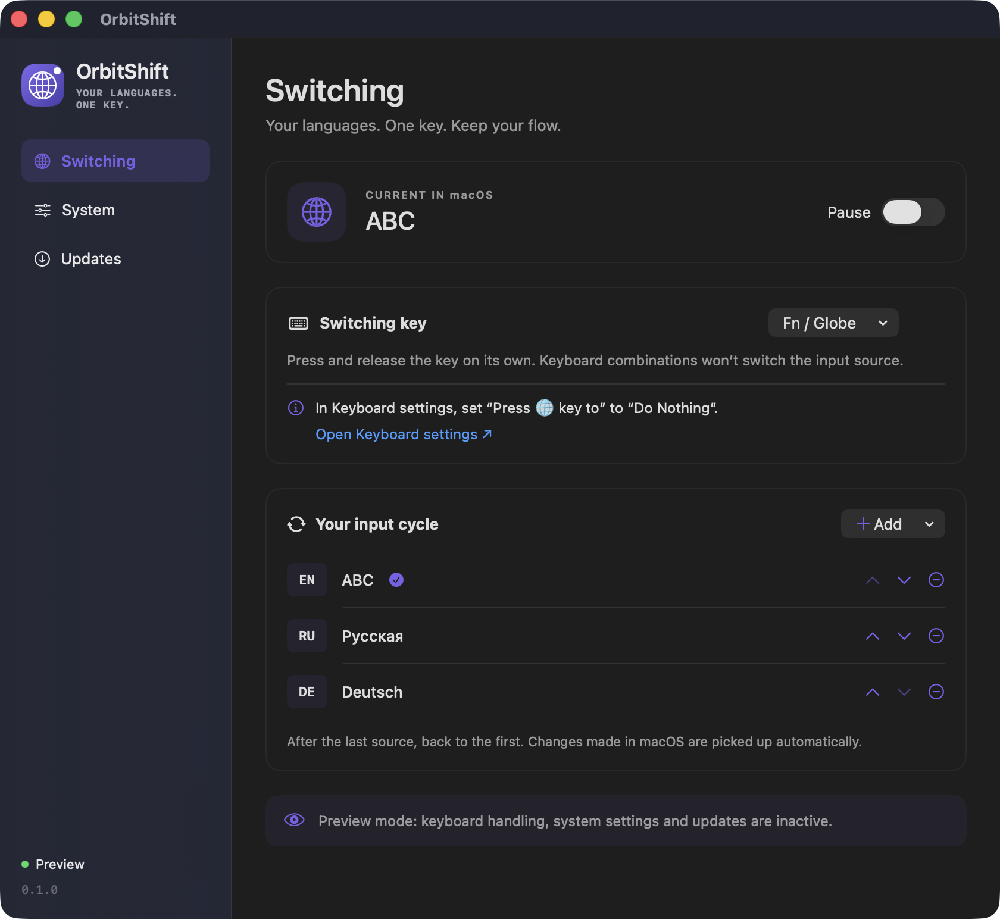
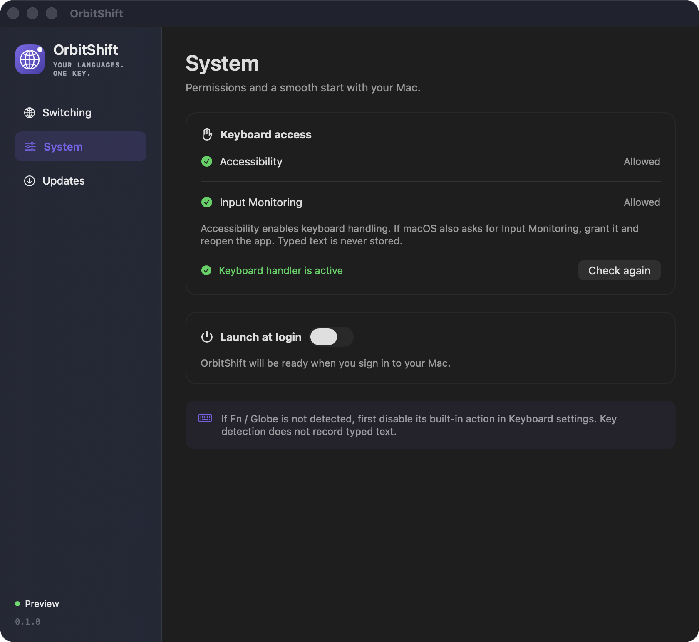

# OrbitShift — macOS keyboard layout switcher

**Your languages. One key.**

Switch input languages on your Mac with a single **Fn / Globe** key press. OrbitShift is a native menu bar app that moves to the next keyboard layout **when you release the key**, in the order you choose.

[](https://github.com/rvrhiv/OrbitShift/releases/latest)


[**Download for Mac**](https://github.com/rvrhiv/OrbitShift/releases/latest) · [Русский](README.ru.md) · [Report a problem](https://github.com/rvrhiv/OrbitShift/issues)



*The app's preview mode, showing example input sources.*

## Made for typing in more than one language

- **One key, your choice.** Use Fn / Globe, a left or right modifier, or F13–F19.
- **Your own language order.** Keep two layouts or build a longer cycle; rearrange them with the arrow buttons.
- **Keep your shortcuts.** Fn + Delete and other modifier combinations do not trigger a language switch.
- **See the current layout.** A compact country flag in the menu bar follows the active macOS input source, including changes made in the system menu. Choose a layout directly from the flag menu; the current one has a checkmark. Sources without a country use a globe.
- **Stay in the menu bar.** Pause switching whenever you need to, and optionally launch at login.
- **Keep typing private.** No typed text is recorded. Settings stay on your Mac; switching works offline.

The interface is available in English and Russian and follows your Mac's appearance.

## Install

1. Download **`OrbitShift-VERSION.zip`** from the [latest release](https://github.com/rvrhiv/OrbitShift/releases/latest).
2. Unzip it and move **OrbitShift.app** to **Applications**.
3. Open OrbitShift. Its globe icon appears in the menu bar.

**Apple signing:** current releases are not signed with Apple Developer ID or notarized by Apple. If macOS blocks an unidentified developer, first try opening the app, then use **System Settings → Privacy & Security → Open Anyway** if you trust this download. Follow [Apple's instructions](https://support.apple.com/en-us/102445); there is no need to disable Gatekeeper. Sparkle update signatures are separate from Apple's verification.

If you used OrbitShift Dev, quit it before starting OrbitShift. The two apps have separate settings and permissions.

## Set up in a minute

### 1. Allow keyboard access

On first launch, OrbitShift checks Accessibility and shows the native macOS permission request if needed. Use that request to open **System Settings → Privacy & Security → Accessibility**, then enable **OrbitShift**.

The keyboard handler starts after access is granted. If permission is already valid, OrbitShift does not open a permission window. You can check the current state or request access again in **OrbitShift → System**. Input Monitoring is requested only if macOS additionally requires it.

<details>
<summary>See the System page</summary>



*Preview mode; permission states are examples.*

</details>

### 2. Free the Fn / Globe key

Open **System Settings → Keyboard** and set **Press 🌐 key to → Do Nothing**. OrbitShift includes a link to this page under the switching key selector.

This prevents the built-in Globe action from conflicting with OrbitShift. Skip this step if you choose another key.

### 3. Choose your layouts and try it

In **Switching**, choose a key and arrange **Your input cycle**. Use **Add** to include an enabled macOS input source. To install another language first, choose **Add a language in macOS…** from that menu.

Press and release the assigned key **on its own**. For example:

**English → Russian → German → English**

The switch happens on release. Holding another key before or during the press cancels that switch, so a modifier shortcut does not unexpectedly change your layout.

## Supported keys

| Key | Behavior |
| --- | --- |
| Fn / Globe | Default. Disable its built-in macOS action first. |
| Shift, Control, Option, Command | Choose the left or right key separately. Other modifier shortcuts pass through. |
| F13–F19 | The assigned key is reserved for OrbitShift, including when used in combinations. |

Printable keys, Caps Lock and media keys are not offered. Fn event availability depends on the keyboard and macOS configuration. Composition input methods such as Japanese and Chinese have not yet been fully validated.

## Troubleshooting

**Fn does nothing.** Check that the Globe action is set to **Do Nothing**, switching is not paused, and **System** reports an active keyboard handler. Press your selected key once and check its detection status. Try a supported modifier key if your keyboard does not send Fn events.

**The app is missing from Accessibility.** Click **Allow…** in OrbitShift's **System** page to trigger the native request. If needed, add the app with **+** in macOS; **Show app in Finder** locates the correct copy.

**Access stopped working after replacing the app.** This can happen with ad-hoc-signed builds even when the old permission switch looks enabled. Remove the old entry with **−**, add the current app with **+**, and enable it again.

**A language is missing.** Add it in macOS Keyboard settings, then include it in OrbitShift's cycle. Temporarily unavailable sources are skipped without changing your saved order.

## Updates and privacy

OrbitShift checks [GitHub Releases](https://github.com/rvrhiv/OrbitShift/releases) for updates through Sparkle. Automatic checks can be disabled. Installing an update and restarting the app require your confirmation; the update feed and archive are verified with OrbitShift's signing key.

OrbitShift does not record typed text or send typing data or analytics. Preferences stay locally on your Mac. Network access is used for release checks and downloads, not for switching languages.

## Build from source

Requires macOS 14+ and Xcode with Swift 6.0+. SwiftPM downloads the pinned Sparkle dependency.

```sh
git clone https://github.com/rvrhiv/OrbitShift.git
cd OrbitShift
bash Scripts/build-app.sh Release
open 'build/OrbitShift Dev.app'
```

Local builds are named **OrbitShift Dev** and display versions such as **0.1.0-dev.1**. Each successful build replaces the previous packaged Dev app; a failed build keeps the old one. Quit the running Dev app before rebuilding. Dev settings are separate, and official updates cannot replace a Dev build.

[Contributing and diagnostics](CONTRIBUTING.md) · [Release workflow](docs/releasing.md)
