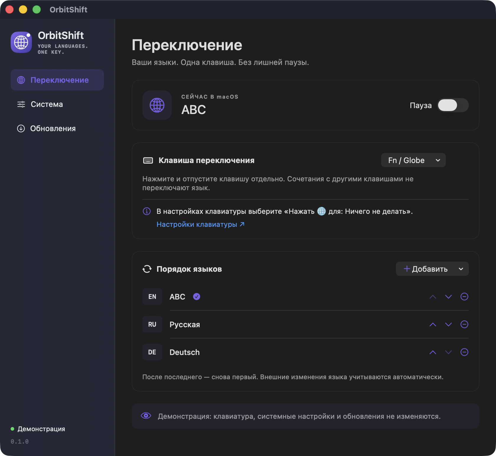
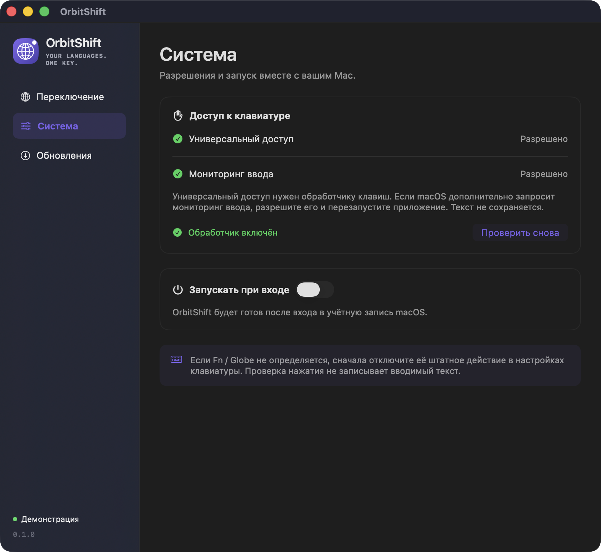

# OrbitShift — переключатель раскладки для macOS

**Ваши языки. Одна клавиша.**

Переключайте язык на Mac одиночным нажатием **Fn / Globe**. OrbitShift живёт в строке меню и выбирает следующую раскладку **при отпускании клавиши**, в заданном вами порядке.

[](https://github.com/rvrhiv/OrbitShift/releases/latest)


[**Скачать для Mac**](https://github.com/rvrhiv/OrbitShift/releases/latest) · [English](README.md) · [Сообщить о проблеме](https://github.com/rvrhiv/OrbitShift/issues)



*Интерфейс приложения в режиме демонстрации с примерами раскладок.*

## Для тех, кто печатает на нескольких языках

- **Одна удобная клавиша.** Fn / Globe, левый или правый модификатор, F13–F19.
- **Свой порядок языков.** Две раскладки или длинный цикл — порядок меняется кнопками со стрелками.
- **Привычные сочетания.** Fn + Delete и другие комбинации с модификаторами не переключают язык.
- **Текущая раскладка перед глазами.** Компактный флаг в строке меню следует выбранному источнику ввода macOS, в том числе при смене языка через системное меню. В меню флага можно сразу выбрать раскладку; текущая отмечена галочкой. Для источников без страны показывается глобус.
- **Работа в строке меню.** Переключение можно поставить на паузу, а приложение — запускать при входе.
- **Приватность.** Набираемый текст не записывается. Настройки хранятся на Mac, переключение работает без интернета.

Интерфейс доступен на русском и английском и следует теме оформления macOS.

## Установка

1. Скачайте **`OrbitShift-VERSION.zip`** на странице [последнего релиза](https://github.com/rvrhiv/OrbitShift/releases/latest).
2. Распакуйте архив и перенесите **OrbitShift.app** в **Программы**.
3. Запустите OrbitShift. В строке меню появится значок глобуса.

**Подпись приложения:** текущие релизы не подписаны сертификатом Apple Developer ID и не прошли нотариализацию Apple. Если macOS блокирует приложение неизвестного разработчика, сначала попробуйте открыть его, затем, если доверяете загрузке, подтвердите запуск в **Системные настройки → Конфиденциальность и безопасность → Всё равно открыть**. Название кнопки зависит от версии macOS; подробности — в [инструкции Apple](https://support.apple.com/ru-ru/102445). Отключать Gatekeeper не нужно. Подпись обновлений Sparkle не заменяет проверку Apple.

Если вы пользовались OrbitShift Dev, завершите его перед запуском OrbitShift. У этих приложений отдельные настройки и разрешения.

## Первая настройка

### 1. Разрешите обработку клавиатуры

При первом запуске OrbitShift проверяет доступ и при необходимости показывает системный запрос macOS. Нажмите в нём кнопку перехода в **Системные настройки → Конфиденциальность и безопасность → Универсальный доступ** и включите **OrbitShift**.

После выдачи доступа обработчик включается автоматически. Если разрешение уже действует, лишнее окно не открывается. Проверить состояние или повторить запрос можно на странице **Система** в OrbitShift. «Мониторинг ввода» запрашивается только тогда, когда macOS дополнительно требует его для работы.

<details>
<summary>Посмотреть страницу «Система»</summary>



*Режим демонстрации; состояния разрешений показаны для примера.*

</details>

### 2. Отключите стандартное действие Fn / Globe

Откройте **Системные настройки → Клавиатура** и установите **Нажать клавишу 🌐 для → Ничего не делать**. Ссылка на эту страницу есть прямо под выбором клавиши в OrbitShift.

Так штатное действие глобуса не будет конфликтовать с приложением. Если выбрали другую клавишу, этот шаг можно пропустить.

### 3. Выберите раскладки и попробуйте

На странице **Переключение** выберите клавишу и настройте **Порядок языков**. Кнопка **Добавить** показывает включённые источники ввода macOS. Чтобы сначала установить ещё один язык, выберите в этом меню **Добавить язык в macOS…**.

Нажмите и отпустите назначенную клавишу **без других клавиш**. Например:

**Английский → Русский → Немецкий → Английский**

Язык меняется при отпускании. Если другая клавиша была зажата заранее или нажата во время удержания, переключение отменяется — сочетание с модификатором не меняет раскладку.

## Какие клавиши поддерживаются

| Клавиша | Как работает |
| --- | --- |
| Fn / Globe | По умолчанию. Сначала отключите её стандартное действие в macOS. |
| Shift, Control, Option, Command | Левую и правую клавишу можно выбрать отдельно. Остальные сочетания проходят как обычно. |
| F13–F19 | Назначенная клавиша полностью резервируется за OrbitShift, в том числе в сочетаниях. |

Печатные клавиши, Caps Lock и медиаклавиши не предлагаются. Доступность событий Fn зависит от клавиатуры и настроек macOS. Методы ввода с композицией, например японский и китайский, пока не прошли полную проверку.

## Если что-то не работает

**Fn не переключает язык.** Проверьте действие **Ничего не делать**, отсутствие паузы и состояние **Обработчик включён** на странице «Система». Нажмите выбранную клавишу и посмотрите, определяется ли она. Если клавиатура не передаёт события Fn, попробуйте другой поддерживаемый модификатор.

**Приложения нет в «Универсальном доступе».** Нажмите **Разрешить…** на странице «Система», чтобы вызвать системный запрос. При необходимости добавьте приложение кнопкой **+** в macOS; кнопка **Показать приложение в Finder** поможет найти нужную копию.

**Разрешение перестало работать после обновления с 0.1.0 или 0.1.1.** Эти версии использовали ad-hoc-подпись. При переходе на постоянный сертификат нужно один раз выдать доступ заново: удалите прежнюю запись кнопкой **−**, добавьте текущую копию кнопкой **+** и включите доступ. Следующие сборки с тем же сертификатом сохраняют разрешение. У production и Dev отдельные сертификаты и разрешения.

**Нет нужного языка.** Добавьте его в настройках клавиатуры macOS, затем включите в цикл OrbitShift. Временно недоступные источники пропускаются; сохранённый порядок остаётся прежним.

## Обновления и приватность

OrbitShift проверяет [GitHub Releases](https://github.com/rvrhiv/OrbitShift/releases) через Sparkle. Автоматические проверки можно отключить. Установка и перезапуск происходят после вашего подтверждения; лента и архив проверяются по ключу подписи OrbitShift.

Приложение не записывает набираемый текст, не отправляет его и не собирает аналитику. Настройки остаются на вашем Mac. Интернет используется для проверки и загрузки релизов, а не для переключения языков.

## Сборка из исходников

Нужны macOS 14+ и Xcode со Swift 6.0+. SwiftPM скачает закреплённую версию Sparkle.

```sh
git clone https://github.com/rvrhiv/OrbitShift.git
cd OrbitShift
python3 Scripts/setup-signing.py
bash Scripts/build-app.sh Release
open 'build/OrbitShift Dev.app'
```

Локальные сборки называются **OrbitShift Dev**, версия отображается в формате **0.1.0-dev.1**. Успешная сборка заменяет предыдущий Dev-пакет, неудачная сохраняет старый. Перед пересборкой завершите работающую Dev-версию. Её настройки отделены от обычного приложения, а официальные обновления не заменяют Dev-сборку.

Настройка подписи выполняется один раз и повторно использует ключ в вашей Связке ключей «Вход». Сохраняйте этот ключ и `.local-builds/Development-Certificate.pem`, чтобы macOS узнавала новые Dev-сборки. Подписка Apple Developer не нужна.

[Разработка и диагностика](CONTRIBUTING.md) · [Публикация релизов](docs/releasing.md)
